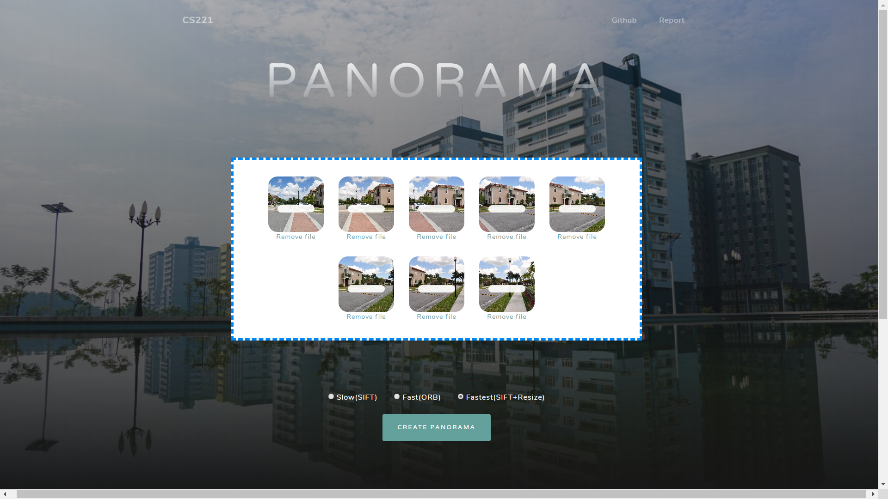

# Web-App-Demo-Panorama
<li>Built with Opencv + Python + Flask
<li>This web app contains an implementation of multiple image stitching
<li>For more detailed information ->>> https://github.com/koyomin9zx/Panorama

### Requirement
<li>python3 (or higher)

### *Install opencv-contrib-python since some none-free features are not avilable*

    pip install opencv-contrib-python==3.4.2.17 --force-reinstall

### You will need to install some package:
<li>numpy
<li>Flask
<li>Flask-Dropzone
<li>Flask-WTF

### To run :
    $ git clone https://github.com/koyomin9zx/Web-App-Demo-Panorama

    $ python app.py

Then go to http://127.0.0.1:5000 with your favourite browser.

<caption>Demo</caption>  
 
  
